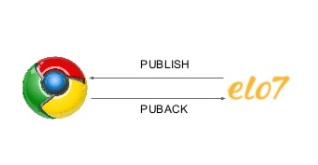
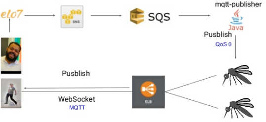

Nesse post vamos explicar alguns modelos arquiteturais para se criar um chat em realtime que deve atender as seguintes especificações.
* Mensagem 1-N (Apenas o usuário que recebeu a mensagem deve receber a notificação (callback) de nova mensagem)
* Realtime (O chat do destinatario deve ser atualizado sem nenhuma ação por parte do usuário)
* Lightspeed (Todo o processo de enviar a mensagem e o recebimento deve ser rapido, consumir o minimo de banda e processamento do remetente, destinatario e servidor)

 Quando se pensa em criar aplicações realtime logo vem na cabeça alguns modelos arquiteturais como WebSocket e Long Pooling, ambos tem seus prós e contras como vamos ver a seguir.

# Long Pooling

É o modelo no qual o cliente fica fazendo requisições para o servidor em um determinado intervalo de tempo. É o mais facil e rapido de ser implementado.

Pseudo code que fica buscando as mensagem da conversa
```
while(true){
	GET("http://localhost:8080/conversa/1/messages")
}
```

Simples, facil e rapido. Porem qual o problema? Gera um enorme overhead no servidor, o clinte fica batendo no servidor mesmo que não tenha nada de novo, não é performatico.
Isso torna a solução bem dificil de escalar, imagine o seguinte cenario, 10mil usuários online no site, o servidor ira receber 10mil request por segundos apenas por os usuários estarem com a pagina aberta, agora imagine que cada usuário esta com 3 abas abertas, 10k * 3 = 30K Req/s (1.8 millhoes Req/min). Resultado DDoS em nós mesmos.

# WebSocket + HTTP

Como o http não foi pensando sendo uma via de 2 mãos, apenas de ida, fica dificil para o servidor informar nossa pagina que um evento especifico aconteceu e a pagina(ou parte dela) deve ser atualizada. Pensando nessa necessidade foi criado o WebSocket, com apenas uma requisição a conexão é aberta e mantida aberta com o servidor. Com isso o servidor consegue se comunica com o browser, e o browser reagir sem intervenção do usuário a cada mensagem que o servidor manda.

Bom, porem ainda temos um problema e ele se chama HTTP.
No HTTP temos um overhead de headers.

Um dos nossos requisitos é que ele seja Lightspeed. Esse overhead aumenta o tamanho da mensagem, consome mais banda e bateria. Segundo um [estudo do google](http://dev.chromium.org/spdy/spdy-whitepaper) os requests variam entre 200 bytes até 2kb, com a maioria na casa dos 700-800 bytes.
```
~ $ curl -s -w \%{size_header} -o /dev/null www.elo7.com.br
438 bytes
```

# WebSocket + MQTT


MQTT é um protocolo de transporte que utiliza o paradigma publisher/subscriber. Leve, aberto, simples e desenhado para ser facil de implmentar. Essas caracteristicas fazem ele ser ideal para o uso de comunicação M2M (Machine to Machine) e IoT.

Foi criado em 1999 por um engenheiro da IBM com o intuito de conectar dutos de óleo aos satelites, durante a sua criação foi levantado que ele deveria ter as seguintes caracteristicas.
* Simples de implementar
* Garantia de entrega (QoS)
* Leve e utilização eficiente da banda
* Data Agnostic (Os dados podem ser enviados e recebidos independente da linguagem)
* Continuous Session Awareness (O estado da sessão deve ser preservado no disconnect/reconnect)
* Pub/Sub

O MQTT resolve o problema que temos no HTTP do overhead de headers, é possivel enviar uma mensagem com um header de apenas 2 bytes, abaixo temos o formato de como deve ser a requisição


A tabela abaixo temos uma comparação entre MQTT e HTTP


## Pub/Sub

Uma das vantagens do Pub/Sub é o desacoplamento que ela gera, o publisher não precisa saber para quem ou quantos clientes ele esta enviando a mensagem. Isso é possivel graças ao MQTT Broker. O broker filtra as mensagens baseado em topicos, cada cliente envia uma mensagem para um topico e quem tiver feito o subs daquele topico recebe a mensagem


## Broker e Client
### Broker
É o coração e o cerebro do MQTT é o responsavem por receber e enviar as mensagens para as pessoas corretas, garantia de entrega (QoS), session, algumas implementações tem features adicionais como segurança, clusterização e suporte a websocket.

[Lista de borkers](https://github.com/mqtt/mqtt.github.io/wiki/brokers)

### Client
É a lib que vai ficar dentro da sua aplicação, é a responsavel por se conectar, enviar e receber as mensagens dos broker. Os clients estão [disponiveis em varias linguagens](https://github.com/mqtt/mqtt.github.io/wiki/libraries) como java, javascript, .NET, C++, Go, IOS, etc. Isso quer dizer que é possivel enviar e receber mensagens desde aplicações web até pequenos dispositivos IOT como sensores de temperatura. O cliente se conecta com o broker enviando uma mensagem de ´CONNECT´ e o broker deve responder com ´CONNACK´, após a conexão estabelecida ela é mantida aberta até o cliente se desconectar ou perder a conexão.

### Quality of Service (QoS)
QoS é o nivel de garantia de entrega das mensagens entre cliente e servidor.

Existem 3 niveis:

QoS 0 - At most once


Garante o menor nivel de entrega, tambem chamado de fire and forget é o mais rapido, consome menos banda porem representa a menor garantia de entrega entre todos. O ciclo de vida é composto apenas pelo cliente enviar uma mensagem para o broker.


QoS 1 - At last once



Garante que a mensagem sera enviada pelo menos uma vez ao broker. Após a mensagem ser enviada o cliente guarda essa mensagem até receber o PUBACK do broker, caso o PUBACK não seja recebido em um determinado tempo o cliente envia outro PUBLISH. Pelo lado do broker quando ele recebe um PUBLISH com QoS 1 a mensagem é processada de imediato enviando para todos os SUBs e respondendo para o cliente com o PUBACK.
O cliente utiliza o packetId que é retornado no PUBACK para fazer a associação entre PUBLISH e PUBACK


QoS 2 - Exacly once


Garante que cada mensagem é recebida pelo menos uma vez pelo outro lado, entre todos é que tem a maior garantia de entrega porem o mais lento.


Tenha em mente que quanto maior o QoS mais trocas de mensagens são feitas, isso afeta o tempo que a mensagem é efetivamente entregue, faz mais banda, processamento e bateria serem consumidos.


## Arquitetura real time da Elo7



A imagem acima é um resumo de como utilizamos o MQTT + WebSocket.
Quando o comprador enviam uma mensagem sobre o pedido existe a necessidade de realizar diversas operações secundarias (enviar metricas, capturar eventos, enviar push, notificar o mosquitto) afim de não comprometer a operação principal que seria apenas salvar a mensagem no banco. Nosso evento de notificar o mosquitto é realizado de forma assíncrona, uma mensagem é enviada para uma fila no SQS, temos um worker que fica escutando essa fila que é quem efetivamente vai notificar o topico da conversa no mosquitto. Pelo outro lado temos o vendedor que ao abrir a conversa se conecta por WebSocket ao topico daquela conversa no mosquitto utilizando o client MQTT (pahoJS no nosso caso), com isso ao receber uma nova mensagem do comprador a conversa é atualizada sem nenhuma interação (Ex: refresh na página) por parte do vendedor.

## Conclusão

Foi demonstrado que existem certas vantagens ao se adotar o mqtt com WebSocket, porem nem tudo são unicornios e arco-íris realtime na sua janela os custos para manter esse tipo de arquitetura é maior tanto de infra como manutenção, tempo de desenvolvimento e complexidade são maires. Caso decida por MQTT é necessario ter um bom conhecimento do broker escolhido, conhecer suas vontagens e desvantagens em relação aos outros, como você vai escalar ele no futuro, como trabalhar com brokers distribuidos, segurança, afinal não vamos querer usuários que não façam parte da conversa  fazendo sub no topico da conversa que não pertence a ele.
A escolha por cada tipo de arquitetura vai depender de uma analise do seu negócio, se vale a pena o investimento/retorno, se faz sentido determinada funcionalidade ser realtime, entre muitas outras coisas.
